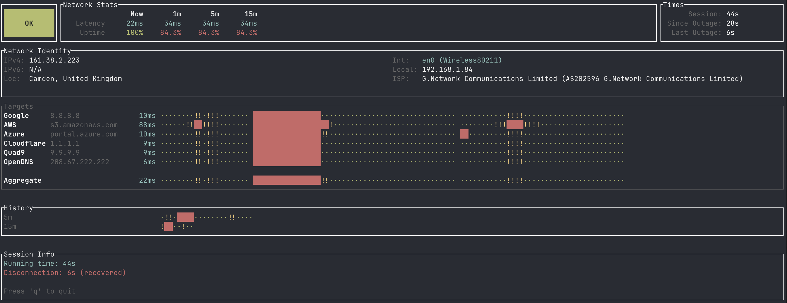

# hale

[](https://github.com/adamatan/hale/actions/workflows/test_and_release.yml)

**hale** is a lightweight, high-precision network connection quality monitor. It answers the critical question: *"Is my internet connection OK right now?"*

**hale** uses concurrent TCP probing across six major global networks (Google, AWS, Azure, Cloudflare, Quad9, OpenDNS) to provide an at-a-glance health assessment without requiring root/sudo privileges.



## Quick Start

### Installation

```bash
cargo install hale
```

### Basic Usage

```bash
# Run the interactive TUI (default)
hale

# Quick connection check (CLI mode)
hale --check

# Verbose output with timestamps
hale --check --verbose

# Machine-readable JSON output
hale --check --format json
```

## Main Commands

### Interactive TUI Mode (Default)

```bash
hale
```

The default mode provides a full-screen dashboard for continuous monitoring:
*   **Top Banner**: Real-time status, average latency, and uptime timer
*   **Targets**: Live latency and status history for each of the 6 providers
*   **Overview**: 5m and 1h sliding windows of your overall connection health
*   **Exit**: Press `q`, `ESC`, or `Ctrl+C`

### CLI Mode (One-shot Check)

Ideal for quick checks or integration into scripts:

```bash
# Basic check
hale --check

# Verbose output
hale --check --verbose

# JSON output for scripts
hale --check --format json
```

**Exit Codes:**
*   `0`: Connection is **OK**
*   `1`: Connection is **Slow** or **Disconnected**

## Key Features

*   **Dual Mode Operation**:
    *   **TUI (Default)**: Rich, real-time dashboard with historical status bars and per-provider metrics
    *   **CLI (`--check`)**: One-shot diagnostic tool with proper exit codes for scripts and automation
*   **Intelligent Analysis**:
    *   **Multi-Provider Probing**: Simultaneously monitors Google, AWS, Azure, Cloudflare, Quad9, and OpenDNS
    *   **Majority Voting**: Uses a 4/6 threshold to filter out localized network noise or single-provider outages
    *   **High Frequency**: 500ms update interval for immediate detection of micro-dropouts
*   **Historical Visibility**:
    *   Per-provider status history bars
    *   5-minute and 1-hour aggregate connection overviews
    *   Automatic downtime tracking and duration calculation
*   **Lean & Safe**:
    *   **Resource Efficient**: Memory footprint < 5MB, CPU usage < 1%
    *   **Zero Configuration**: Works out of the box with sensible defaults
    *   **Terminal Safety**: Implements panic hooks to ensure your terminal is always restored to its original state

## How It Works

### Monitoring Targets

Hale monitors the entry points of the world's most critical internet infrastructure:
1.  **Google**: `8.8.8.8`
2.  **AWS**: `s3.amazonaws.com`
3.  **Azure**: `portal.azure.com`
4.  **Cloudflare**: `1.1.1.1`
5.  **Quad9**: `9.9.9.9`
6.  **OpenDNS**: `208.67.222.222`

### Status Thresholds

*   **OK**: Latency < 100ms
*   **Slow**: Latency 100-300ms
*   **Disconnected**: Latency > 300ms or majority (4/6) timeout

### Technology Stack

*   **Language**: Rust (2021 Edition)
*   **Async Runtime**: `tokio` (v1) for concurrent non-blocking probing
*   **TUI Framework**: `ratatui` with `crossterm` backend
*   **CLI Parsing**: `clap` (v4) with derive macros

### Module Structure

*   **Monitor**: Handles concurrent TCP (port 443) handshake probing
*   **Analysis**: Aggregates raw data and applies majority voting for stability
*   **UI**: Renders the interactive TUI and formatted CLI outputs
*   **Utils**: Provides session logging with automatic downtime calculation

## Logging

Hale automatically creates a detailed session log at:
```
/tmp/hale-{timestamp}.log
```

This log records every status change and precisely calculates how long each network incident lasted.

## Development

### Building from Source

```bash
# Clone the repository
git clone https://github.com/adamatan/hale.git
cd hale

# Build the release binary
cargo build --release

# The binary is now available at
./target/release/hale
```

### Testing

Hale includes a comprehensive suite of unit tests covering its analysis engine and probing logic.

```bash
cargo test
```

### Release Process

This project uses an automated release workflow powered by [release-plz](https://github.com/MarcoIeni/release-plz).

*   **Trigger**: Pushing to the `main` branch
*   **Versioning**: Determined automatically based on [Conventional Commits](https://www.conventionalcommits.org/)
    *   `fix:` -> Patch bump
    *   `feat:` -> Minor bump
    *   `BREAKING CHANGE:` -> Major bump
*   **Publishing**: Automatically publishes to [crates.io](https://crates.io/crates/hale) and creates a GitHub release/tag

## License

This project is licensed under the MIT License - see the LICENSE file for details.
